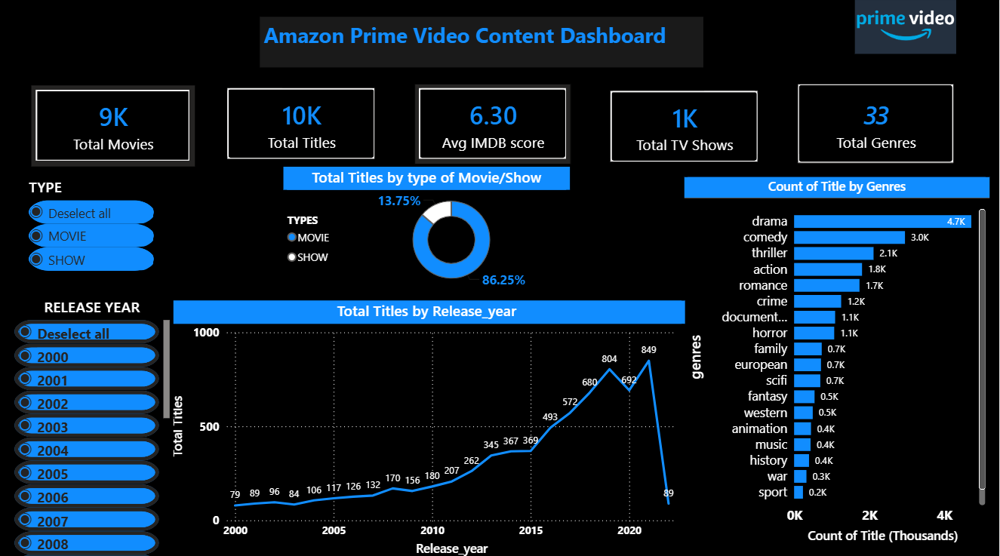

# Amazon Prime Video Content Dashboard

## Objective
To analyze Amazon Prime Video's content library and identify 
genre trends, content growth patterns, and movie vs show 
distribution to support content strategy decisions.

## Dashboard Preview

## Tools Used
- Power BI (Dashboard & DAX measures)
- Power Query (Data cleaning & transformation)
- Dataset: Amazon Prime Movies and TV Shows (Kaggle)

## Key Insights
- Drama is the most popular genre with 4.7K titles
- 86% of content is Movies, 14% TV Shows
- Content grew sharply post-2014, peaking at 849 titles in 2021
- Average IMDb score across all content is 6.30
- Filtered from year 2000 onwards as pre-2000 data is sparse

## Data Model
- Two source tables: titles and credits linked by title ID
- Separate titles_genres table for genre-level analysis

## Known Limitations
- Genre chart does not dynamically filter with slicers due to exploded table structure
- 2021 data is incomplete in the source dataset
- 
  to exploded table structure
- 2021 data is incomplete in the source dataset
